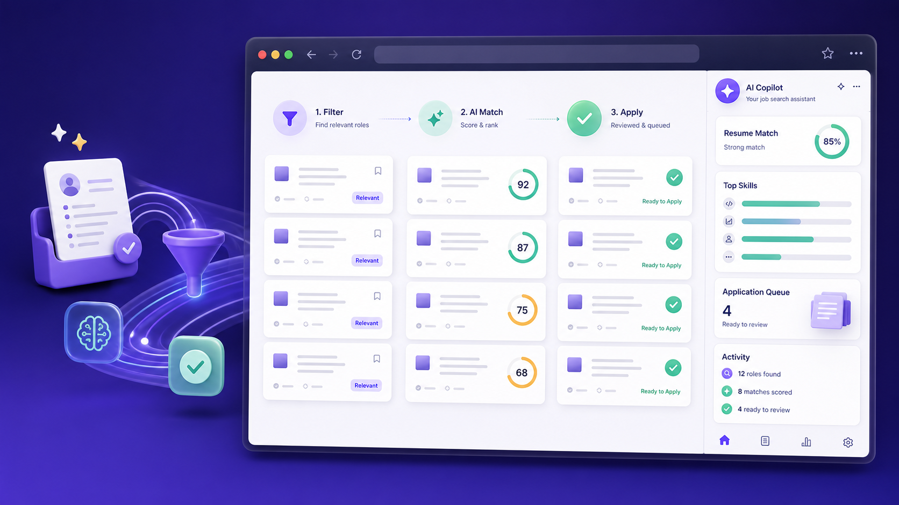

<div align="center">



# 职舟 AI 求职智能体

**在 Edge 侧边栏完成岗位筛选、简历 AI 匹配，以及“先预览、后填写”的可靠网申。**

[](https://github.com/leooo-sketch/ai-job-copilot-edge/stargazers)

[](LICENSE)

[English](README.md) · [快速开始](#快速开始) · [路线图](ROADMAP.md) · [参与贡献](CONTRIBUTING.md)

</div>

> 一个本地优先、过程透明的开源求职智能体。它自动处理重复步骤，但不会替你隐藏重要决策：先筛选岗位，再根据真实简历评分，最后由你审核并确认投递。

## 核心流程

```text
岗位列表 → 硬条件初筛 → AI 简历/JD 匹配 → 人工审核 → 限速投递
```

没有自建服务器，不绕过验证码，也不会在未经确认时投递。

## 发布版本与分类

| 版本 | 分类 | 版本内容 |
|---|---|---|
| `v0.1.0` | 首个公开版 | Edge 侧边栏、招聘网站适配、AI 匹配、人工审核队列和安全投递流程 |
| `v0.4.1` | 最新累积增强版 | 可靠网申填充、资料库 v3、多简历本地解析、千问复核、动态经历卡片和兼容性修复 |

`0.2.0` 至 `0.4.0` 是已经合并进 `v0.4.1` 的开发里程碑。由于没有保留下来相互独立的完整源码快照，因此不把它们伪装成单独的源码包；各阶段功能和时间顺序完整记录在 [CHANGELOG.md](CHANGELOG.md) 中。

## 功能

- 三阶段工作流：收集岗位、AI 匹配、审核投递。
- 通用网申填充：在普通 HTTP(S) 网申页面扫描字段，先逐项预览，再填写所选内容。
- 完整资料库 v3：教育、工作、实习、项目都按独立卡片保存，并为学校、公司、职位、时间、职责、成果、项目背景、目标、技术栈、交付物和量化指标等常见网申项提供单独输入框。
- 多简历一键入库：PDF、DOCX、TXT、MD 在浏览器本地提取文字，再由千问按证据整理；支持多选并合并去重。
- 动态经历展开：扫描前识别“添加教育/工作/实习/项目经历”按钮，按资料条数安全创建输入卡片，再逐条映射，解决只有“添加项目经验”却扫描不到项目字段的问题。
- 记录智能对齐：网页已填写学校、公司或项目名时，先在资料库中找到对应经历，再补齐该卡片的其他字段，避免按数组顺序串错记录；兼容常见框架的隐藏下拉和只读日期控件。
- 千问语义复核：对低置信度或企业自定义字段给出可解释映射；模型只能引用资料库已有路径，不能生成填充值。
- 跨栏目保护：企业只有“实习经历”入口时，可建议将真实工作经历映射进去，但保留工作性质、取消默认勾选并要求人工确认。
- 保守字段识别：综合标签、占位词、标准 autocomplete、所属章节、控件类型、排除词、置信度和歧义差距。
- 安全默认值：不覆盖网页已有内容；敏感字段永不默认勾选；不自动选择附件；不点击提交按钮。
- 支持岗位、城市、薪资、公司黑名单和职位黑名单。
- 根据简历生成匹配分、摘要、优势、缺口、风险和真实招呼语。
- 支持千问（阿里云百炼，含深度思考）、DeepSeek、OpenAI 和本机 OpenAI 兼容接口。
- 常驻 Microsoft Edge 侧边栏。
- 投递前必须二次明确确认。
- 每批最多 20 个岗位，可配置间隔；遇到验证码或安全验证自动停止。
- 简历、配置、API Key 和日志保存在扩展本地存储中。
- 权限严格限定，没有使用 `<all_urls>`。

## 当前支持

| 类型 | 支持范围 |
|---|---|
| 岗位发现网站 | BOSS 直聘、猎聘、智联招聘 |
| 网申自动填充 | 普通 HTTP(S) 网申页面；点击扫描时只申请当前网站权限 |
| 云端模型 | 千问百炼、DeepSeek、OpenAI Chat Completions |
| 本地模型 | `localhost` / `127.0.0.1` 上的 OpenAI 兼容接口 |
| 浏览器 | 支持 Manifest V3 Side Panel 的 Microsoft Edge |

招聘网站会不定期改版。如果网页能打开但扫描不到岗位，通常需要更新 `content-script.js` 中对应站点的选择器，欢迎提交适配 PR。

## 快速开始

1. 下载仓库或 Release 压缩包并解压。
2. Edge 地址栏打开 `edge://extensions`。
3. 开启“开发人员模式”。
4. 点击“加载解压缩的扩展”，选择包含 `manifest.json` 的目录。
5. 将扩展固定到工具栏并点击图标。
6. 登录支持的招聘网站，打开职位搜索结果列表。

### 首次配置

1. 在配置中导入千问 API Key 文件，或手工填写 Key；默认模型为 `qwen-plus`。
2. 在资料库中多选上传 PDF、DOCX、TXT 或 Markdown 简历；文件只在本地解析，提取后的文字交给千问整理。
3. 设置目标岗位、城市、薪资和黑名单。
4. 保存后依次执行：**扫描当前页 → AI 匹配 → 审核 → 确认并投递**。

第一次建议只选 1–3 个岗位，先确认当前版本与招聘网站最新页面兼容。

### 可靠网申填充

1. 在侧边栏顶部切换到 **网申填充**。
2. 打开 **维护资料库**，可多选上传 PDF/DOCX/TXT/MD 并用千问生成资料库，也可导入/导出 JSON；生成后先核对再保存。
3. 打开企业网申页，点击 **扫描当前表单**。扩展会先按资料条数安全展开教育、工作、实习和项目卡片，再扫描字段；只在你点击时申请当前域名权限。
4. 本地规则先映射，启用后千问再复核语义。普通高置信度字段会默认选中；模糊项、跨栏目项和敏感项不会默认选中。
5. 点击 **填写所选字段**，然后在网页中逐项核对并由你手动提交。

## 隐私和安全

- 项目没有自建后端。
- 结构化网申资料保存在 `chrome.storage.local`。本地规则始终先运行；启用千问复核时，只发送非敏感职业资料、资料路径和当前表单字段元数据。
- PDF/DOCX 文件本身不会上传；浏览器用打包的 PDF.js 与 Mammoth 本地提取文字。点击“一键生成资料库”后，提取文字会发送给你配置的模型服务商。
- 任意网申网站权限属于可选权限，扫描时只请求当前网站，不使用必选 `<all_urls>` 权限。
- 网页已有值不会被覆盖；附件必须手动上传；网申填充功能没有提交表单的代码路径。
- 只有启用 AI 功能时，所需的简历文字、岗位描述或非敏感表单映射上下文才会发给你配置的模型服务商。
- 远程模型只允许千问百炼、DeepSeek 和 OpenAI；HTTP 仅允许本机地址。
- 招聘网页内容通过 `textContent` 渲染，避免 HTML 注入。
- 日志会隐藏 API Key。
- 检测到验证码、滑块、访问异常或安全验证会停止，不包含绕过功能。
- 某些网站点击“立即沟通”就会实际发起沟通，请务必核对所选岗位和最终页面。

详细说明见 [PRIVACY.md](PRIVACY.md) 和 [SECURITY.md](SECURITY.md)。

## 开发检查

需要 Node.js 18+。PDF.js 与 Mammoth 作为本地运行时依赖打包在 `vendor/`，许可证见 `THIRD_PARTY_NOTICES.md`：

```bash
npm test
npm run check
```

## 路线图

- 更稳定的站点适配器与选择器诊断
- 扫描版 PDF 的本地 OCR
- 跨域 iframe 诊断与按需授权
- 每个平台首次真实投递前的预演模式
- 可导出的求职记录
- Edge 扩展商店发布包
- 更多语言和招聘平台

如果这个项目帮你节省了时间，欢迎点一个 **Star**，让更多求职者找到它。

## 免责声明

本项目是独立开源工具，与 Microsoft、BOSS 直聘、猎聘、智联招聘、阿里云、DeepSeek 或 OpenAI 均无隶属关系。用户应自行遵守各平台用户协议、频率限制和投递规则。高频或重复投递可能导致账号受限。

## License

[MIT](LICENSE) © 2026 [leooo-sketch](https://github.com/leooo-sketch)
